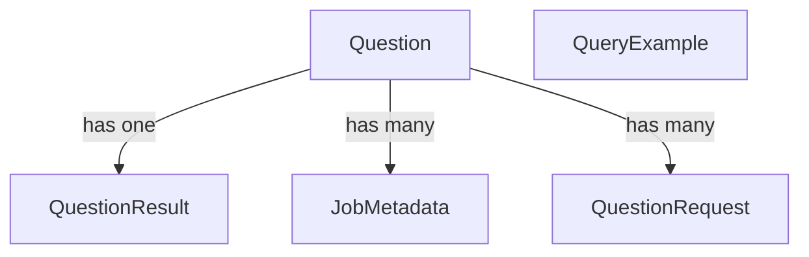

# GitHub Trends — Monorepo

This repository contains both the frontend (React + Vite + Tailwind) and the backend (Fastify + TypeScript) for the GitHub Trends Analyzer.

## Overview
- `github-trends-frontend/`: React app that lets users enter natural language questions and view charts/results
- `github-trends-backend/`: API that converts natural language to BigQuery SQL, executes jobs, and streams updates

## Quick Start

### Run with Docker Compose
Prerequisites:
- Docker + Docker Compose
- configure GCP ADC for BigQuery (https://cloud.google.com/bigquery/docs/authentication)

Steps:
```bash
# from repo root
cp github-trends-backend/.env.example github-trends-backend/.env
# open github-trends-backend/.env and fill in values

# build and start everything
docker compose up --build
```
Services:
- Backend API: `http://localhost:3000` (API under `/api`)
- Frontend: `http://localhost:8080`
- Postgres: `localhost:5433` (DB `github_trends_db`)
- Redis: `localhost:6380`

Notes:
- Compose command for backend runs `npm run db:deploy` before starting dev server.
- Ensure your backend `.env` exists before starting containers.


## Backend Details

### Key Tech
- Fastify, TypeScript
- Bull + Redis for background jobs and SSE updates
- Prisma + Postgres for persistence (+ pgvector extension)
- OpenAI for LLM planning and chart config suggestions
- BigQuery gateway with dry-run size checks (default 3 GB limit)

### Testing

- Unit tests: `cd github-trends-backend && npm run test:unit`
- Integration tests (require .env, Postgres, and Redis):
```bash
cd github-trends-backend
npm run test:integration
```

### Adding query examples
```
curl --request POST \
  --url http://localhost:3000/api/examples/upsert \
  --header 'Content-Type: application/json' \
  --header 'User-Agent: insomnia/11.0.2' \
  --data '{
	"title": "Top commenters in period",
	"promptText": "get top commenters in interval from 2013 01 01 to 01 02",
	"sqlSnippet": "WITH events AS ( SELECT id, type, actor.login AS actor_login, repo.name AS repo_name, COALESCE(org.login, SPLIT(repo.name, '\''/'\'')[OFFSET(0)]) AS org_login, payload, created_at FROM `githubarchive.day.2013*` WHERE _TABLE_SUFFIX BETWEEN '\''0101'\'' AND '\''0102'\'' ) SELECT actor_login, COUNT(*) AS comments\nFROM events\nWHERE type = '\''IssueCommentEvent'\''\nGROUP BY actor_login\nORDER BY comments DESC\nLIMIT 20;",
	"tags": ["githubarchive"]
}'
```

### Searching query examples by prompt similarity
```
curl --request POST \
  --url http://localhost:3000/api/examples/search \
  --header 'Content-Type: application/json' \
  --header 'User-Agent: insomnia/11.0.2' \
  --data '{
	"prompt": "Top commenters in interval from 2012 02 03 to 02 04",
	"limit": 1
}'
``` 

## Database schema


- **Question**: primary entity with user prompt, title, sql plan to generate the query, generated bigquery SQL and metadata. One-to-one (optional) with `QuestionResult`; one-to-many with `JobMetadata` and `QuestionRequest`. Has two types: user (default) and suggested. Suggested questions are popular questions that are automatically set by a scheduled job.
- **QuestionResult**: stores the computed result for a single `Question` (unique `questionId`).
- **JobMetadata**: background job metadata (Bull/Redis) tied to a `Question` (`questionId`), includes unique `bullJobId`.
- **QuestionRequest**: audit of inbound requests per `Question` (source + timestamps). Useful for aggregating data for repeated questions.
- **QueryExample**: standalone examples with `prompt_text`, `sql_snippet`, optional `chart_hint`, `tags` (array) and `embedding` (pgvector). This is useful when populating the context for generating the bigquery SQL with relevant query examples and chart outputs.

## Frontend Details

### Key Tech
- React 18, Vite, TypeScript
- TailwindCSS + Radix UI components
- React Query/SWR hooks for data fetching
- Recharts for visualizations

### Chart examples


